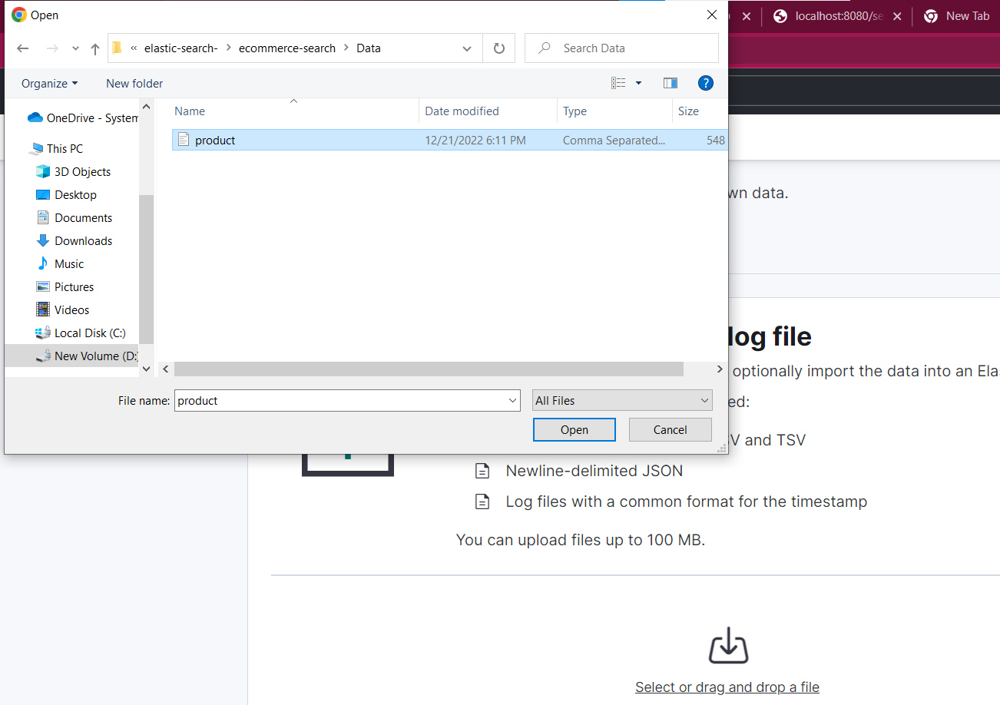

# Elasticsearch Using Spring Boot Java Client

#### This example contains ecommerce use case of elastic search,where we search products using different queries. 

### Prerequisite:
- docker
- elasticsearch
- kibana

##### please follow below link to set up elasticsearch and kibana
https://www.elastic.co/guide/en/elasticsearch/reference/current/run-elasticsearch-locally.html
|Elasticsearch|->|Database| |————-|——–| |Index|->|Table| |Document|->|Row| |Field|->|Column|

### Data Ingestion Into Elasticsearch

There are many ways to ingest data into elastic search:

- Java Client Api , in this example you can use endpoint : /index
- Use Kibana to upload data 

##### USING Java Client Api:

    @PostMapping("/index")
    public ResponseEntity<String> createIndex(@RequestBody Product product) throws IOException {
    var response = elasticSearchService.createIndex(product);
    return new ResponseEntity<>(response, HttpStatus.OK);
    }

##### USING KIBANA 

### Query Data

    @GetMapping("/search")
    public @ResponseBody ResponseEntity<List<Product>> searchText(@RequestParam(name = "q")String q,@RequestParam(name = "by") SearchFields by) throws IOException {
    var response = elasticSearchService.searchQuery(q,by.getFieldName());
    return new ResponseEntity<List<Product>>(response, HttpStatus.OK);
    }

##### Using Kibana to query data

##### Kibana Queries
:cmart is index name

GET cmart/_doc/80000

POST /cmart/_search?typed_keys=true {"query":{"match":{"productTitle":{"query":"King"}}}}
