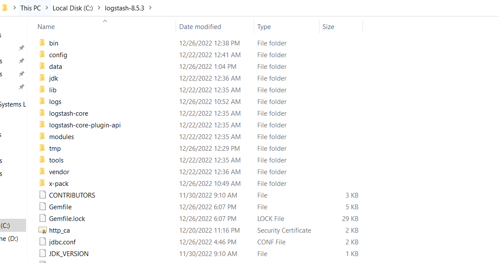
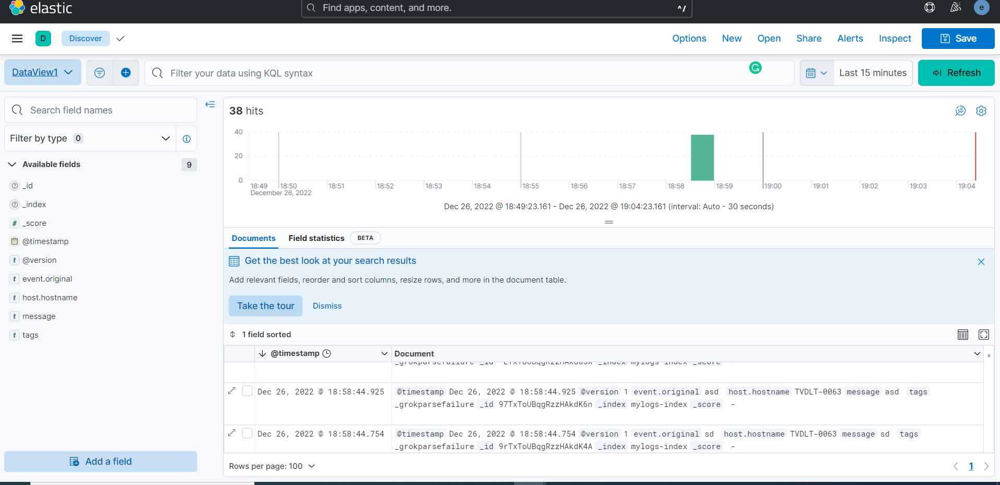
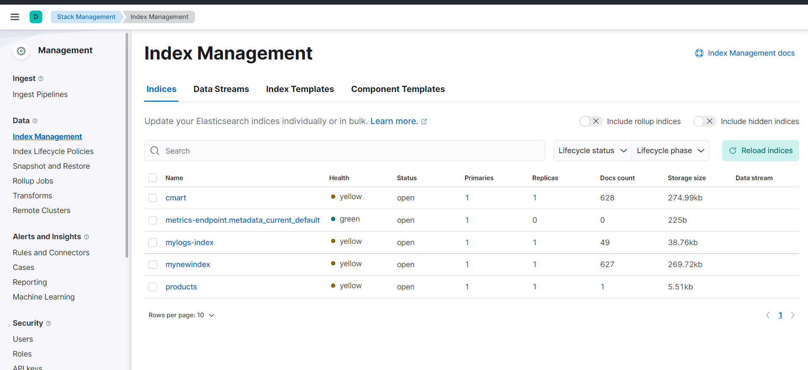
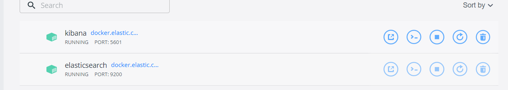

# LOGSTASH INGESTION EXAMPLES
This example contains multiple examples of logstash config that would help in data ingestion into elastic search database

### PRE-REQUISITE

* ELASTIC SEARCH
* KIBANA
* LOGSTASH

##### Setting up elastic search ,Logstash and kibana

##### Elastic Search:
    
    docker network create elastic
    docker pull docker.elastic.co/elasticsearch/elasticsearch:8.5.3
    docker run --name elasticsearch --net elastic -p 9200:9200 -p 9300:9300 -e "discovery.type=single-node" -t docker.elastic.co/elasticsearch/elasticsearch:8.5.3
    

##### Kibana:

    docker pull docker.elastic.co/kibana/kibana:8.5.3
    docker run --name kibana --net elastic -p 5601:5601 docker.elastic.co/kibana/kibana:8.5.3

note: copy the password and use below command to generate ca-cert

    docker cp es01:/usr/share/elasticsearch/config/certs/http_ca.crt .

##### Logstash:

Download logstash from below and extract :

    https://www.elastic.co/downloads/logstash

Copy the given config file in /config folder and run below command inside bin folder:
    
    logstash -f C:\logstash-8.5.3\config\console-input-to-elastic-search.conf

Once Logstash is up paste below test logs in console and press enter

    127.0.0.1 - - [11/Dec/2013:00:01:45 -0800] "GET /xampp/status.php HTTP/1.1" 200 3891 "http://cadenza/xampp/navi.php" "Mozilla/5.0 (Macintosh; Intel Mac OS X 10.9; rv:25.0) Gecko/20100101 Firefox/25.0"

##### Analyze Logs on kibana

Go to Management -> Index Management   

Go to Data View and create new data view of particular index to analyze data i.e mylogs-index would be my index for this scenario

